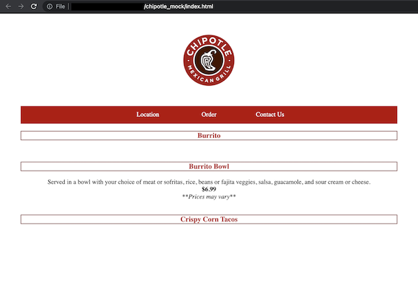

## Description
Chipotle menu mock using vanilla JavaScript / JQuery.

## Instructions

```
1. Clone / download repo
```

<pre>
2. Open the following file path with web browser:
 <ul><li><b><i>~/chipotle_mock/index.html</i></b></li></ul>
</pre>


## Technologies & Tools
<a href="https://developer.mozilla.org/en-US/docs/Web/JavaScript" target="_blank" rel="noreferrer">
 
</a>
<a href="https://jquery.com/" target="_blank" rel="noreferrer">
 
</a>

## Screenshot




## Disclaimer

"This menu is a mockup created for a project and is not an official menu of Chipotle. The prices and items listed on this menu are not necessarily accurate and are intended for educational or demonstration purposes only."
